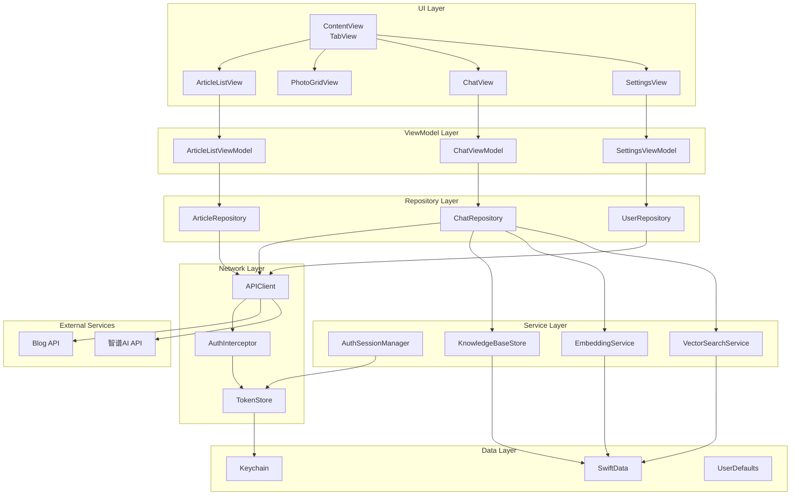
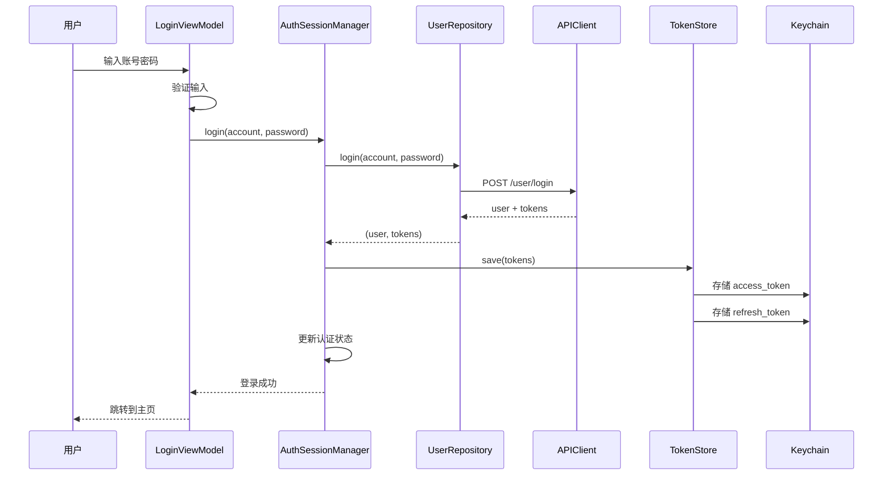
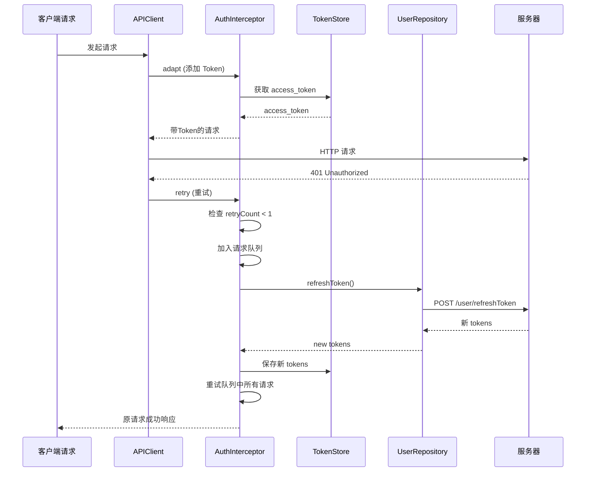
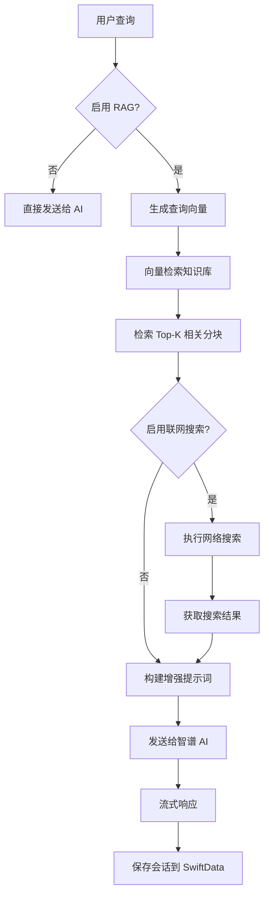
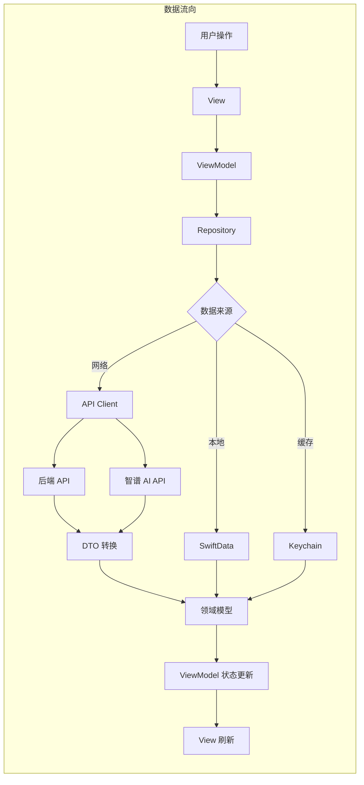

# DreamzeroBlog 产品报告

---

## 一、产品功能介绍

### 1.1 产品概述

**DreamzeroBlog** 是一款基于 SwiftUI 构建的现代化 iOS 博客应用，集成了人工智能、知识库管理和社交功能。应用采用 MVVM 架构，结合 SwiftData 持久化、Factory 依赖注入和 Alamofire 网络层，为用户提供流畅的内容消费和智能交互体验。

### 1.2 核心功能模块

#### 1.2.1 文章系统
- **文章列表**：分页加载，支持下拉刷新和无限滚动
- **文章详情**：Markdown 渲染，支持代码高亮
- **标签筛选**：按标签分类浏览文章
- **阅读统计**：浏览量、点赞数展示

#### 1.2.2 日常照片
- **瀑布流布局**：自适应照片网格展示
- **照片详情**：大图预览、元数据查看
- **图片缓存**：使用 Kingfisher 实现高效缓存
- **照片保存**：支持保存到相册

#### 1.2.3 AI 聊天
- **流式对话**：集成智谱 AI GLM-4.7，实现 SSE 实时流式响应
- **多轮对话**：完整的上下文记忆
- **会话管理**：创建、加载、删除聊天会话
- **RAG 增强**：结合知识库和联网搜索，提供精准回答
- **Markdown 渲染**：支持富文本和代码块显示

#### 1.2.4 RAG 知识库
- **文档上传**：支持文本文件上传和管理
- **自动同步**：将文章和照片自动同步为知识源
- **本地向量化**：使用 Apple NaturalLanguage 框架生成词向量
- **语义检索**：基于余弦相似度的向量搜索
- **分块管理**：智能文本分块，支持自定义分块策略

#### 1.2.5 用户系统
- **用户注册**：邮箱验证码注册流程
- **用户登录**：支持用户名/邮箱/手机号登录
- **个人资料**：头像、昵称、简介等信息管理
- **密码管理**：修改密码、重置密码
- **操作日志**：查看账户操作历史

#### 1.2.6 设置管理
- **API 配置**：自定义智谱 AI API 端点
- **知识库管理**：查看和管理知识库文档
- **RAG 设置**：配置检索参数（Top-K、相似度阈值）
- **账户设置**：账户信息和安全设置

### 1.3 特色功能亮点

| 功能 | 描述 |
|------|------|
| **实时流式对话** | 基于 SSE 协议的逐字显示，提供流畅的 AI 交互体验 |
| **本地向量检索** | 完全在设备端执行，保护用户隐私 |
| **JWT 自动刷新** | 无感知的 Token 刷新机制，确保会话连续性 |
| **主题系统** | 支持文章主题和聊天气泡主题切换 |
| **会话持久化** | 聊天记录自动保存到 SwiftData |
| **自动分页** | 智能检测滚动位置，自动加载更多内容 |

---

## 二、程序概要设计

### 2.1 技术栈

#### 核心框架
| 框架 | 版本 | 用途 |
|------|------|------|
| SwiftUI | - | 声明式 UI 框架 |
| SwiftData | - | 数据持久化 |
| Combine | - | 响应式编程 |
| NaturalLanguage | - | 本地 NLP 和向量嵌入 |

#### 第三方库
| 库 | 版本 | 用途 |
|------|------|------|
| Alamofire | 5.10.2 | 网络请求 |
| Factory | 2.5.3 | 依赖注入 |
| KeychainAccess | master | 安全存储 |
| Kingfisher | 8.6.0 | 图片加载和缓存 |
| NetworkImage | 6.0.1 | 网络图片组件 |
| Swift Markdown UI | 2.4.1 | Markdown 渲染 |
| SwiftyBeaver | 2.1.1 | 日志记录 |

### 2.2 代码组织结构

```
DreamzeroBlog/
├── DTO/                    # 数据传输对象（API 响应模型）
├── Models/                 # 领域模型
│   └── Persistence/        # SwiftData 持久化模型
├── Endpoints/              # API 端点定义
├── Repositorys/            # 数据仓库层
├── ViewModels/             # 视图模型
├── Views/                  # 视图层
│   ├── Register/           # 注册流程
│   └── Settings/           # 设置子页面
├── Services/               # 业务服务层
├── Utils/                  # 工具类
│   ├── Networking/         # 网络层
│   └── Keychain/           # 安全存储
├── Interceptors/           # 请求拦截器
├── DependencyInject/       # 依赖注入配置
├── Themes/                 # 主题系统
└── Layouts/                # 自定义布局
```

### 2.3 数据模型设计

#### 模型分层架构
```
┌─────────────────┐
│   DTO Layer     │  API 响应模型
├─────────────────┤
│  Domain Layer   │  领域模型
├─────────────────┤
│ Persistence     │  SwiftData 模型
│    Layer        │
└─────────────────┘
```

#### 核心数据模型

| 模型 | 说明 |
|------|------|
| Article | 文章领域模型 |
| Photo | 照片领域模型 |
| User | 用户领域模型 |
| ChatMessage | 聊天消息模型 |
| KnowledgeBase | 知识库文档模型 |
| APIConfiguration | API 配置模型 |

### 2.4 网络层架构

#### 请求流程
```
View
  ↓
ViewModel
  ↓
Repository
  ↓
Endpoint (协议定义)
  ↓
APIClient (Alamofire 封装)
  ↓
AuthInterceptor (认证拦截)
  ↓
Backend API
```

#### API 端点协议

```swift
public protocol APIEndpoint: Sendable {
    var path: String { get }
    var method: HTTPMethod { get }
    var encoder: ParameterEncoder { get }
    var parameters: Encodable? { get }
    var headers: HTTPHeaders? { get }
    var requiresAuth: Bool { get }
    var timeout: TimeInterval? { get }
}
```

---

## 三、软件架构图

### 3.1 系统整体架构



### 3.2 认证流程



### 3.3 Token 自动刷新机制



### 3.4 RAG 知识库工作流程



### 3.5 数据流架构



---

## 四、技术亮点及实现原理

### 4.1 JWT 自动刷新机制

#### 问题背景
- 访问令牌有效期仅 5 分钟，频繁过期影响用户体验
- 需要在无感知的情况下自动刷新令牌
- 避免多个请求同时触发刷新操作

#### 实现原理

**核心文件**: [DreamzeroBlog/Interceptors/Auth/AuthInterceptor.swift](DreamzeroBlog/Interceptors/Auth/AuthInterceptor.swift)

**请求适配** - 每次请求自动附加 Token：
```swift
func adapt(_ urlRequest: URLRequest, for session: Session, completion: @escaping (Result<URLRequest, Error>) -> Void) {
    var request = urlRequest

    // 从 URL 查询参数提取元数据
    let requiresAuth = extractRequiresAuth(from: urlRequest.url)

    guard requiresAuth, !hasCustomAuthHeader else {
        completion(.success(urlRequest))
        return
    }

    // 附加 Authorization 头
    if let token = try? tokenStore?.currentAccessToken() {
        request.setValue("Bearer \(token)", forHTTPHeaderField: "Authorization")
    }

    completion(.success(request))
}
```

**请求重试** - 401 时自动刷新并重试：
```swift
func retry(_ request: Request, for session: Session, dueTo error: Error, completion: @escaping (RetryResult) -> Void) {
    guard response.statusCode == 401, request.retryCount < 1 else {
        completion(.doNotRetry)
        return
    }

    // 串行刷新，避免并发刷新
    lock.lock()
    queuedCompletions.append(completion)
    let shouldRefresh = !isRefreshing
    if shouldRefresh {
        isRefreshing = true
    }
    lock.unlock()

    guard shouldRefresh else { return }

    // 刷新 Token
    Task {
        do {
            let newTokens = try await refresher.refreshToken(oldRefreshToken: refreshToken)
            try tokenStore?.save(newTokens)
            flushQueue(with: .retry)
        } catch {
            flushQueue(with: .doNotRetry)
        }
    }
}
```

#### 技术亮点
- **请求队列**: 多个并发请求只刷新一次 Token
- **重试限制**: 最多重试 1 次，防止无限循环
- **元数据传递**: 通过 URL 查询参数传递认证元数据

---

### 4.2 SSE 流式 AI 对话

#### 问题背景
- 传统请求-响应模式用户体验不佳
- 需要实时显示 AI 生成内容
- 支持长文本流式传输

#### 实现原理

**核心文件**: [DreamzeroBlog/Utils/Networking/APIClient.swift](DreamzeroBlog/Utils/Networking/APIClient.swift)

**流式请求方法**：
```swift
public func streamRequest(_ endpoint: APIEndpoint) async throws -> AsyncThrowingStream<String, Error> {
    return AsyncThrowingStream { continuation in
        Task {
            do {
                let (bytes, response) = try await URLSession.shared.bytes(for: urlRequest)

                for try await line in bytes.lines {
                    if line.hasPrefix("data: ") {
                        let jsonString = String(line.dropFirst(6))

                        if jsonString == "[DONE]" {
                            continuation.finish()
                            break
                        }

                        continuation.yield(jsonString)
                    }
                }
            } catch {
                continuation.finish(throwing: error)
            }
        }
    }
}
```

**流式响应节流** - 避免频繁 UI 更新：

**核心文件**: [DreamzeroBlog/ViewModels/ChatViewModel.swift](DreamzeroBlog/ViewModels/ChatViewModel.swift)

```swift
private let updateInterval: TimeInterval = 0.1  // 100ms 更新一次
private var lastUpdateTime = Date()

for try await chunk in stream {
    streamingContent += chunk

    let now = Date()
    if now.timeIntervalSince(lastUpdateTime) >= updateInterval {
        lastUpdateTime = now
        await updateStreamingContent()  // 节流更新 UI
    }
}
```

#### 技术亮点
- **AsyncThrowingStream**: Swift 原生异步流支持
- **SSE 协议解析**: 自动处理 `data:` 前缀和 `[DONE]` 标记
- **UI 节流**: 10fps 更新频率，平衡性能和体验

---

### 4.3 本地向量嵌入

#### 问题背景
- 需要对中文文本进行语义检索
- 保护用户隐私，避免数据上传
- iOS 端实现 NLP 功能

#### 实现原理

**核心文件**: [DreamzeroBlog/Services/EmbeddingService.swift](DreamzeroBlog/Services/EmbeddingService.swift)

**使用 Apple NaturalLanguage 框架**：
```swift
import NaturalLanguage

func generateEmbedding(for text: String) async throws -> [Double] {
    let embedding = try await withCheckedThrowingContinuation { continuation in
        nlModel.embed(text) { embedding, error in
            if let error = error {
                continuation.resume(throwing: error)
            } else if let embedding = embedding {
                continuation.resume(returning: Array(embedding))
            }
        }
    }
    return embedding
}
```

**中文词向量模型**：
```swift
private static func loadChineseWordEmbedding() -> NLEmbedding? {
    // 使用 MLModel 加载预训练的中文词向量模型
    let config = MLModelConfiguration()
    config.computeUnits = .all

    guard let modelUrl = Bundle.main.url(forResource: "ChineseWordEmbedding", withExtension: "mlmodelc") else {
        return nil
    }

    guard let model = try? MLModel(contentsOf: modelUrl, configuration: config) else {
        return nil
    }

    return NLEmbedding(mlModel: model)
}
```

**平均池化策略** - 将词向量聚合为句向量：
```swift
private func averagePool(_ embeddings: [[Double]]) -> [Double] {
    guard !embeddings.isEmpty else { return [] }

    var sum = [Double](repeating: 0, count: embeddings[0].count)

    for embedding in embeddings {
        for (index, value) in embedding.enumerated() {
            sum[index] += value
        }
    }

    return sum.map { $0 / Double(embeddings.count) }
}
```

#### 技术亮点
- **设备端处理**: 完全在本地执行，保护隐私
- **Apple 原生框架**: 无需第三方依赖
- **异步执行**: 不阻塞主线程

---

### 4.4 RAG 知识库系统

#### 问题背景
- 增强 AI 回答的准确性
- 结合用户自有知识库
- 支持联网搜索补充信息

#### 实现原理

**核心文件**: [DreamzeroBlog/Services/VectorSearchService.swift](DreamzeroBlog/Services/VectorSearchService.swift)

**向量检索** - 基于余弦相似度：
```swift
func search(queryEmbedding: [Double], chunks: [KBChunk], topK: Int = 3) -> [KBChunk] {
    let scored = chunks.compactMap { chunk -> (KBChunk, Double)? in
        guard let embedding = chunk.embedding, !embedding.isEmpty else {
            return nil
        }
        let similarity = cosineSimilarity(queryEmbedding, embedding)
        return similarity >= threshold ? (chunk, similarity) : nil
    }

    return scored
        .sorted { $0.1 > $1.1 }
        .prefix(topK)
        .map { $0.0 }
}

private func cosineSimilarity(_ a: [Double], _ b: [Double]) -> Double {
    guard a.count == b.count else { return 0 }

    var dotProduct = 0.0
    var normA = 0.0
    var normB = 0.0

    for i in 0..<a.count {
        dotProduct += a[i] * b[i]
        normA += a[i] * a[i]
        normB += b[i] * b[i]
    }

    return dotProduct / (sqrt(normA) * sqrt(normB))
}
```

**文本分块服务** - 智能分割长文本：

**核心文件**: [DreamzeroBlog/Services/ChunkingService.swift](DreamzeroBlog/Services/ChunkingService.swift)

```swift
func chunk(text: String, strategy: ChunkingStrategy = .separator) -> [String] {
    switch strategy {
    case .separator:
        return text.components(separatedBy: separators)
            .filter { $0.trimmingCharacters(in: .whitespaces).count >= minChunkSize }
    case .character(let size):
        return text.chunked(into: size)
    }
}
```

**RAG 增强流程**：

**核心文件**: [DreamzeroBlog/ViewModels/ChatViewModel.swift](DreamzeroBlog/ViewModels/ChatViewModel.swift)

```swift
private func enhanceQueryWithRAG(_ query: String) async -> String {
    // 1. 生成查询向量
    let queryEmbedding = try await embeddingService.generateEmbedding(for: query)

    // 2. 检索知识库
    let kbResults = vectorSearchService.search(
        queryEmbedding: queryEmbedding,
        chunks: allChunks,
        topK: ragConfig.topK
    )

    // 3. 联网搜索（可选）
    var webContext = ""
    if ragConfig.enableWebSearch {
        let webResults = try await webSearchService.search(query: query)
        webContext = webResults.map { "- [\($0.title)](\($0.url))" }.joined(separator: "\n")
    }

    // 4. 构建增强提示词
    let context = kbResults.map { $0.content }.joined(separator: "\n\n")
    return """
    参考知识库内容：
    \(context)

    联网搜索结果：
    \(webContext)

    用户问题：\(query)
    """
}
```

#### 技术亮点
- **本地优先**: 向量检索完全在设备端执行
- **混合检索**: 支持知识库 + 联网搜索
- **可配置**: Top-K、相似度阈值等参数可调

---

### 4.5 MVVM + Repository 架构

#### 架构设计

```mermaid
graph TB
    subgraph "View Layer"
        V1[ArticleListView]
        V2[ChatView]
    end

    subgraph "ViewModel Layer"
        VM1[ArticleListViewModel]
        VM2[ChatViewModel]
    end

    subgraph "Repository Layer"
        R1[ArticleRepository]
        R2[ChatRepository]
    end

    subgraph "Network Layer"
        N1[APIClient]
    end

    V1 <-->|@Observable| VM1
    V2 <-->|@Observable| VM2
    VM1 -->|Protocol| R1
    VM2 -->|Protocol| R2
    R1 --> N1
    R2 --> N1
```

#### 实现特点

**协议驱动** - Repository 抽象：
```swift
protocol ArticleRepositoryType {
    func fetchList(page: Int, pageSize: Int) async throws -> [Article]
    func fetchDetail(id: String) async throws -> Article
}
```

**Observable 状态管理**：
```swift
@Observable
final class ArticleListViewModel {
    private(set) var state: State = .idle
    private(set) var articles: [Article] = []
    private(set) var hasMore: Bool = true

    func load() async {
        state = .loading
        do {
            articles = try await repository.fetchList(page: 1, pageSize: 10)
            state = .loaded
        } catch {
            state = .failed(error.localizedDescription)
        }
    }
}
```

#### 技术亮点
- **清晰的分层**: UI 层与业务逻辑完全分离
- **协议抽象**: 便于单元测试和替换实现
- **状态驱动**: 使用状态机管理 UI 状态

---

### 4.6 依赖注入（Factory）

#### 问题背景
- 解耦组件依赖
- 便于单元测试
- 解决循环依赖

#### 实现原理

**核心文件**: [DreamzeroBlog/DependencyInject/](DreamzeroBlog/DependencyInject/)

**Container 配置**：
```swift
extension Container {
    var apiClient: Factory<APIClient> {
        self {
            // 1. 创建临时客户端（无认证拦截器）
            let tempClient = APIClient(baseURL: baseURL, interceptors: [])

            // 2. 使用临时客户端创建 UserRepository（实现 TokenRefresher）
            let userRepository = UserRepository(client: tempClient)

            // 3. 创建 AuthInterceptor（依赖 TokenStore 和 TokenRefresher）
            let authInterceptor = AuthInterceptor(
                tokenStore: self.tokenStore(),
                refresher: userRepository
            )

            // 4. 创建最终客户端（包含认证拦截器）
            return APIClient(baseURL: baseURL, interceptors: [authInterceptor])
        }.singleton
    }
}
```

**使用注入**：
```swift
// 在 ViewModel 中
@Observable
final class ArticleListViewModel {
    private let repository: ArticleRepositoryType

    init(container: Container = .shared) {
        self.repository = container.articleRepository()
    }
}
```

#### 技术亮点
- **编译时安全**: 编译时检查依赖关系
- **生命周期管理**: 支持单例、瞬态等模式
- **循环依赖解决**: 通过延迟初始化解决

---

## 五、总结

DreamzeroBlog 是一款技术先进、架构清晰的现代化 iOS 应用，主要特点包括：

| 维度 | 评价 |
|------|------|
| **架构设计** | MVVM + Repository + 依赖注入，分层清晰 |
| **用户体验** | 流式 AI 对话、自动分页、主题系统 |
| **技术深度** | 本地向量嵌入、JWT 自动刷新、SSE 流式传输 |
| **安全性** | Keychain 存储、JWT 认证、设备端处理 |
| **可维护性** | 协议驱动、依赖注入、单元测试友好 |

该应用展示了现代 iOS 开发的最佳实践，适合作为参考项目。

---

**报告版本**: 1.0
**生成日期**: 2025-12-30
**项目仓库**: [DreamzeroBlog](https://github.com/This-MOI/ios-dreamzero-blog)
